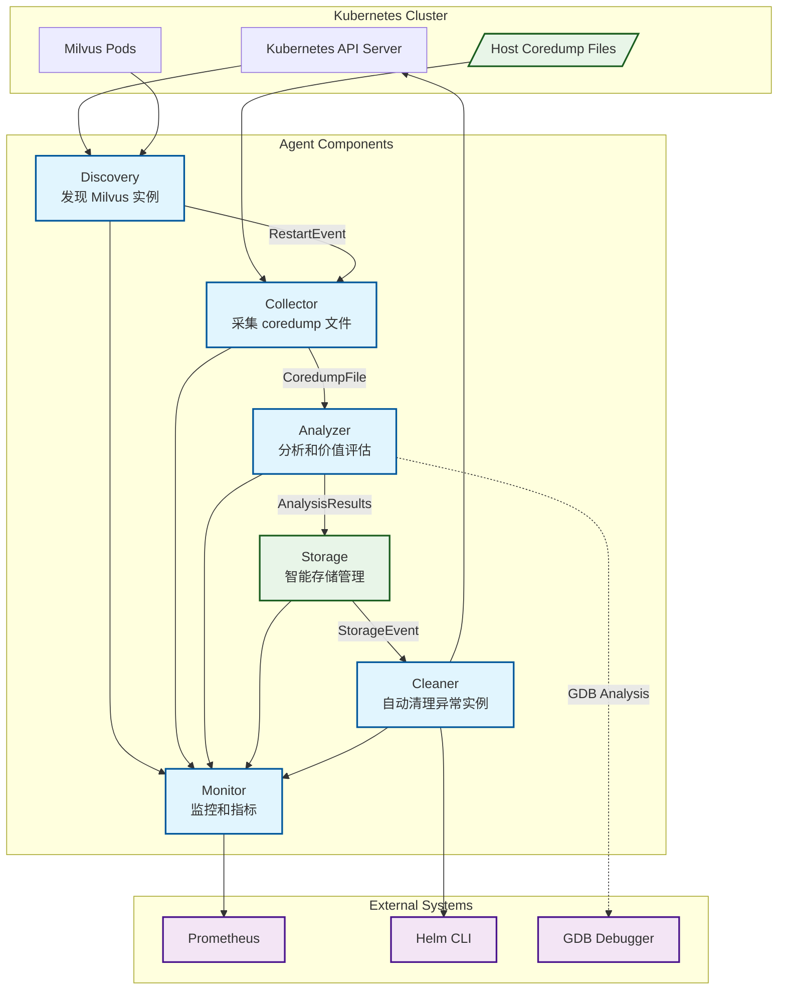
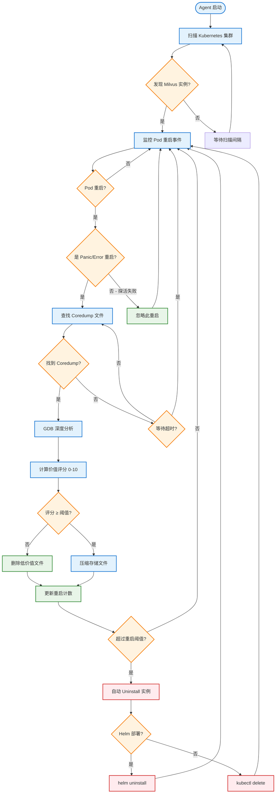

# Milvus Diagnostic Platform

一个用于 Milvus 部署的综合诊断和监控平台，提供智能的 coredump、日志、指标分析和 AI 驱动的诊断报告。

## 功能特性

### 📊 综合监控
- **智能发现**: 自动发现 Kubernetes 集群中的 Milvus 实例（支持 Helm 和 Operator 部署）
- **日志收集**: 从 Loki 获取结构化日志，支持错误模式识别和异常检测
- **指标收集**: 从 Prometheus 获取系统和应用指标，支持时间序列分析
- **事件关联**: 跨数据源关联分析，发现潜在问题根因

### 🔍 深度分析
- **Coredump 分析**: 使用 GDB 对 coredump 文件进行技术分析，评估调试价值
- **🤖 AI 智能分析**: 集成 GLM/OpenAI 对多种数据进行智能分析，提供调试建议
- **趋势预测**: 基于历史数据预测潜在故障和资源需求
- **异常检测**: 自动识别异常模式和性能问题

### 📈 智能报告
- **定期报告**: 自动生成日报、周报、月报
- **多格式输出**: 支持 HTML、PDF、JSON 格式
- **自动发送**: 邮件、Webhook 推送
- **可视化**: Web 仪表盘实时监控和历史数据展示

### 🛠️ 自动运维
- **智能存储**: 基于价值评分保留最有用的诊断数据
- **自动清理**: 检测异常实例并自动处理，防止问题扩散
- **健康检查**: 主动检查服务可用性和依赖状态

## 架构设计



## 快速开始

### 1. 构建镜像

```bash
./scripts/build.sh
```

### 2. 部署到 Kubernetes

```bash
./scripts/deploy.sh
```

### 3. 验证部署

```bash
# 检查 DaemonSet 状态
kubectl get daemonset milvus-coredump-agent

# 查看 Pod 状态
kubectl get pods -l app=milvus-coredump-agent

# 查看日志
kubectl logs -l app=milvus-coredump-agent -f
```

## 配置说明

主要配置文件位于 `configs/config.yaml`，包含以下配置项：

### Agent 配置
- `name`: Agent 名称
- `logLevel`: 日志级别 (debug, info, warn, error)
- `metricsPort`: Prometheus 指标端口 (默认 8080)
- `healthPort`: 健康检查端口 (默认 8081)

### Discovery 配置
- `scanInterval`: 实例扫描间隔
- `namespaces`: 监控的命名空间列表
- `helmReleaseLabels`: Helm 部署识别标签
- `operatorLabels`: Operator 部署识别标签

### Collector 配置
- `coredumpPath`: 容器内 coredump 路径
- `hostCoredumpPath`: 宿主机 coredump 路径
- `watchInterval`: 文件扫描间隔
- `maxFileAge`: 文件最大年龄
- `maxFileSize`: 文件最大尺寸

### Analyzer 配置
- `enableGdbAnalysis`: 是否启用 GDB 分析
- `gdbTimeout`: GDB 分析超时时间
- `valueThreshold`: 价值阈值（低于此值的文件将被跳过）
- `ignorePatterns`: 忽略的容器名称模式
- `panicKeywords`: Panic 关键词列表

#### AI 分析配置
- `aiAnalysis.enabled`: 是否启用 AI 分析
- `aiAnalysis.provider`: AI 提供商 (openai, azure, anthropic)
- `aiAnalysis.model`: 使用的模型 (gpt-4, gpt-3.5-turbo)
- `aiAnalysis.apiKey`: API 密钥（建议通过环境变量设置）
- `aiAnalysis.timeout`: 分析超时时间
- `aiAnalysis.maxTokens`: 最大 Token 数量
- `aiAnalysis.enableCostControl`: 是否启用成本控制
- `aiAnalysis.maxCostPerMonth`: 每月最大成本限制（美元）
- `aiAnalysis.maxAnalysisPerHour`: 每小时最大分析次数

### Storage 配置
- `backend`: 存储后端 (local, s3, nfs)
- `localPath`: 本地存储路径
- `maxStorageSize`: 最大存储容量
- `retentionDays`: 文件保留天数
- `compressionEnabled`: 是否启用压缩

### Cleaner 配置
- `enabled`: 是否启用自动清理
- `maxRestartCount`: 最大重启次数阈值
- `restartTimeWindow`: 重启时间窗口
- `cleanupDelay`: 清理延迟时间
- `uninstallTimeout`: 卸载超时时间

## 监控指标

Agent 提供丰富的 Prometheus 指标：

- `milvus_coredump_agent_coredumps_discovered_total`: 发现的 coredump 文件总数
- `milvus_coredump_agent_coredumps_processed_total`: 处理的 coredump 文件总数
- `milvus_coredump_agent_analysis_successful_total`: 成功分析的文件总数
- `milvus_coredump_agent_value_score_distribution`: 价值评分分布
- `milvus_coredump_agent_files_stored_total`: 存储的文件总数
- `milvus_coredump_agent_instances_uninstalled_total`: 卸载的实例总数
- `milvus_coredump_agent_up`: Agent 运行状态

访问指标：
```bash
kubectl port-forward ds/milvus-coredump-agent 8080:8080
curl http://localhost:8080/metrics
```

## 工作流程



## 🤖 AI 智能分析功能

本系统集成了 OpenAI GPT-4 模型，为 coredump 分析提供智能化的调试建议：

### 分析能力
- **根因分析**: 基于 stack trace 和崩溃信息，智能推断最可能的根本原因
- **代码建议**: 提供具体的代码修复建议，包括文件、函数和行号
- **影响评估**: 评估崩溃对系统的影响程度
- **相关问题**: 识别已知的相似问题和解决方案
- **置信度评分**: AI 对分析结果的置信度评估

### 示例分析结果
```json
{
  "summary": "Vector index segmentation fault during concurrent search operations",
  "rootCause": "Null pointer dereference in index search with uninitialized segment",
  "impact": "High - affects query performance and stability",
  "recommendations": [
    "Add null pointer checks before segment access",
    "Initialize segments properly during index building",
    "Implement proper concurrency control for index operations"
  ],
  "confidence": 0.87,
  "codeSuggestions": [
    {
      "file": "src/index/vector_index.cpp",
      "function": "search_segment",
      "lineNumber": 234,
      "issue": "Missing null pointer check",
      "suggestion": "Add: if (segment == nullptr) return SEGMENT_NOT_FOUND;",
      "priority": "high"
    }
  ]
}
```

### 成本控制
- **每月限额**: 设置 API 调用的月度成本上限
- **频率限制**: 控制每小时分析次数，避免过度使用
- **智能跳过**: 低价值 coredump 文件自动跳过 AI 分析

### 配置 AI 分析
```bash
# 1. 创建包含 API Key 的 Secret
kubectl create secret generic milvus-coredump-agent-secrets \
  --from-literal=openai-api-key=your-actual-api-key

# 2. 或通过环境变量设置
export OPENAI_API_KEY=your-actual-api-key

# 3. 部署时确保 AI 分析已启用（默认启用）
kubectl apply -f deployments/
```

## 📊 基于规则的价值评分系统

系统使用多维度规则对 coredump 文件进行价值评估 (0-10分)：

### 评分维度

| 维度 | 评分规则 | 分值 |
|-----|---------|------|
| **崩溃原因明确性** | 包含明确的崩溃原因 | +2.0 |
| **Panic 关键词** | 包含 panic/fatal/SIGSEGV 等关键词 | +1.0 |
| **调用栈质量** | 调用栈长度 > 100 字符 | +1.5 |
| **多线程复杂性** | 线程数 > 1 | +0.5 |
| **Pod 关联性** | 关联到具体的 Pod 和实例 | +1.0 |
| **信号严重性** | SIGSEGV(11)/SIGABRT(6)/SIGFPE(8) | +1.0 |
| **文件大小** | 文件大小 > 100MB (包含更多信息) | +0.5 |
| **时效性** | 1小时内的新鲜崩溃 | +0.5 |

### 评分示例

```go
// 高价值 coredump (评分 8.5)
- 明确的 SIGSEGV 崩溃原因 (+2.0 + 1.0 + 1.0)
- 完整的调用栈信息 (+1.5) 
- 关联到 milvus-proxy Pod (+1.0)
- 30分钟前的新崩溃 (+0.5)
- 多线程环境 (+0.5)
- 文件大小 150MB (+0.5)
= 总分 8.5

// 低价值 coredump (评分 4.0)  
- 探活失败导致的重启 (基础分 4.0)
- 无明确崩溃原因
- 调用栈信息不完整
= 总分 4.0 (低于阈值，跳过存储)
```

### 阈值过滤
- **默认阈值**: 7.0 分
- **高于阈值**: 存储文件 + 可选 AI 分析
- **低于阈值**: 直接丢弃，节省存储空间

## 🤖 AI 智能分析 (基于评分结果)

**重要**: AI 分析不参与评分计算，而是对已经通过规则评分筛选的高价值文件进行额外的智能分析。

### 分析触发条件
```
规则评分 ≥ valueThreshold → 存储文件 → (可选) AI 分析
```

### AI 分析流程
1. **评分筛选**: 基于规则的评分系统筛选出高价值文件
2. **存储决策**: 评分达到阈值的文件进入存储流程  
3. **AI 增强**: 对存储的文件进行可选的 AI 智能分析
4. **调试增强**: AI 提供额外的调试建议，但不影响存储决策

## 支持的部署方式

### Helm 部署识别
通过以下标签识别 Helm 部署的 Milvus：
- `app.kubernetes.io/name=milvus`
- `helm.sh/chart=milvus`
- `app.kubernetes.io/instance`

### Operator 部署识别
通过以下标签识别 Operator 部署的 Milvus：
- `app.kubernetes.io/managed-by=milvus-operator`
- `milvus.io/instance`

## 权限要求

Agent 需要以下 Kubernetes 权限：
- 读取 Pods、Deployments、Services 等资源
- 删除异常的 Pods 和 Deployments  
- 访问宿主机的 coredump 目录
- 执行 Helm 命令进行 uninstall

## 故障排除

### 常见问题

1. **Agent 无法启动**
   - 检查 RBAC 权限配置
   - 确认 coredump 目录挂载正确

2. **无法发现 Milvus 实例**
   - 验证实例标签配置
   - 检查命名空间设置

3. **GDB 分析失败**
   - 确认容器中安装了 gdb
   - 检查 coredump 文件权限

4. **存储空间不足**
   - 调整 `maxStorageSize` 配置
   - 降低 `valueThreshold` 阈值

### 日志级别

设置 `logLevel: debug` 获取详细的调试信息。

## 安全考虑

- Agent 以 privileged 模式运行以访问宿主机资源
- 敏感信息（如密钥）不会被记录或提交
- 支持网络策略限制 Agent 的网络访问

## 贡献

欢迎提交 Issue 和 Pull Request 来改进这个项目。

## 许可证

[Apache License 2.0](LICENSE)