# Milvus Coredump Agent

一个用于自动采集和分析 Milvus 实例 coredump 文件的 Kubernetes DaemonSet Agent。

## 功能特性

- **智能发现**: 自动发现 Kubernetes 集群中的 Milvus 实例（支持 Helm 和 Operator 部署）
- **实时监控**: 监控 Pod 重启事件，区分 panic/error 导致的重启和探活失败重启
- **深度分析**: 使用 GDB 对 coredump 文件进行技术分析，评估调试价值
- **🤖 AI 智能分析**: 集成 OpenAI GPT-4 对 stack trace 进行智能分析，提供调试建议和代码修复建议
- **智能存储**: 基于价值评分保留最有用的 coredump 文件，支持压缩存储
- **自动清理**: 检测异常实例并自动 uninstall，防止重复生成 coredump
- **监控告警**: 提供 Prometheus 指标和健康检查接口

## 架构设计

```mermaid
graph TB
    subgraph "Kubernetes Cluster"
        K8S[Kubernetes API Server]
        PODS[Milvus Pods]
        COREDUMPS[/Host Coredump Files/]
    end
    
    subgraph "Agent Components"
        DISCOVERY[Discovery<br/>发现 Milvus 实例]
        COLLECTOR[Collector<br/>采集 coredump 文件]
        ANALYZER[Analyzer<br/>分析和价值评估]
        STORAGE[Storage<br/>智能存储管理]
        CLEANER[Cleaner<br/>自动清理异常实例]
        MONITOR[Monitor<br/>监控和指标]
    end
    
    subgraph "External Systems"
        PROMETHEUS[Prometheus]
        HELM[Helm CLI]
        GDB[GDB Debugger]
    end
    
    %% Data flow
    K8S --> DISCOVERY
    PODS --> DISCOVERY
    COREDUMPS --> COLLECTOR
    DISCOVERY -->|RestartEvent| COLLECTOR
    COLLECTOR -->|CoredumpFile| ANALYZER
    ANALYZER -->|AnalysisResults| STORAGE
    STORAGE -->|StorageEvent| CLEANER
    CLEANER --> HELM
    CLEANER --> K8S
    
    %% Analysis flow
    ANALYZER -.->|GDB Analysis| GDB
    
    %% Monitoring
    DISCOVERY --> MONITOR
    COLLECTOR --> MONITOR
    ANALYZER --> MONITOR
    STORAGE --> MONITOR
    CLEANER --> MONITOR
    MONITOR --> PROMETHEUS
    
    %% Styling
    classDef component fill:#e1f5fe,stroke:#01579b,stroke-width:2px
    classDef external fill:#f3e5f5,stroke:#4a148c,stroke-width:2px
    classDef storage fill:#e8f5e8,stroke:#1b5e20,stroke-width:2px
    
    class DISCOVERY,COLLECTOR,ANALYZER,CLEANER,MONITOR component
    class PROMETHEUS,HELM,GDB external
    class STORAGE,COREDUMPS storage
```



## 快速开始

### 1. 构建镜像

```bash
./scripts/build.sh
```

### 2. 部署到 Kubernetes

```bash
./scripts/deploy.sh
```

### 3. 验证部署

```bash
# 检查 DaemonSet 状态
kubectl get daemonset milvus-coredump-agent

# 查看 Pod 状态
kubectl get pods -l app=milvus-coredump-agent

# 查看日志
kubectl logs -l app=milvus-coredump-agent -f
```

## 配置说明

主要配置文件位于 `configs/config.yaml`，包含以下配置项：

### Agent 配置
- `name`: Agent 名称
- `logLevel`: 日志级别 (debug, info, warn, error)
- `metricsPort`: Prometheus 指标端口 (默认 8080)
- `healthPort`: 健康检查端口 (默认 8081)

### Discovery 配置
- `scanInterval`: 实例扫描间隔
- `namespaces`: 监控的命名空间列表
- `helmReleaseLabels`: Helm 部署识别标签
- `operatorLabels`: Operator 部署识别标签

### Collector 配置
- `coredumpPath`: 容器内 coredump 路径
- `hostCoredumpPath`: 宿主机 coredump 路径
- `watchInterval`: 文件扫描间隔
- `maxFileAge`: 文件最大年龄
- `maxFileSize`: 文件最大尺寸

### Analyzer 配置
- `enableGdbAnalysis`: 是否启用 GDB 分析
- `gdbTimeout`: GDB 分析超时时间
- `valueThreshold`: 价值阈值（低于此值的文件将被跳过）
- `ignorePatterns`: 忽略的容器名称模式
- `panicKeywords`: Panic 关键词列表

#### AI 分析配置
- `aiAnalysis.enabled`: 是否启用 AI 分析
- `aiAnalysis.provider`: AI 提供商 (openai, azure, anthropic)
- `aiAnalysis.model`: 使用的模型 (gpt-4, gpt-3.5-turbo)
- `aiAnalysis.apiKey`: API 密钥（建议通过环境变量设置）
- `aiAnalysis.timeout`: 分析超时时间
- `aiAnalysis.maxTokens`: 最大 Token 数量
- `aiAnalysis.enableCostControl`: 是否启用成本控制
- `aiAnalysis.maxCostPerMonth`: 每月最大成本限制（美元）
- `aiAnalysis.maxAnalysisPerHour`: 每小时最大分析次数

### Storage 配置
- `backend`: 存储后端 (local, s3, nfs)
- `localPath`: 本地存储路径
- `maxStorageSize`: 最大存储容量
- `retentionDays`: 文件保留天数
- `compressionEnabled`: 是否启用压缩

### Cleaner 配置
- `enabled`: 是否启用自动清理
- `maxRestartCount`: 最大重启次数阈值
- `restartTimeWindow`: 重启时间窗口
- `cleanupDelay`: 清理延迟时间
- `uninstallTimeout`: 卸载超时时间

## 监控指标

Agent 提供丰富的 Prometheus 指标：

- `milvus_coredump_agent_coredumps_discovered_total`: 发现的 coredump 文件总数
- `milvus_coredump_agent_coredumps_processed_total`: 处理的 coredump 文件总数
- `milvus_coredump_agent_analysis_successful_total`: 成功分析的文件总数
- `milvus_coredump_agent_value_score_distribution`: 价值评分分布
- `milvus_coredump_agent_files_stored_total`: 存储的文件总数
- `milvus_coredump_agent_instances_uninstalled_total`: 卸载的实例总数
- `milvus_coredump_agent_up`: Agent 运行状态

访问指标：
```bash
kubectl port-forward ds/milvus-coredump-agent 8080:8080
curl http://localhost:8080/metrics
```

## 工作流程

```mermaid
flowchart TD
    START([Agent 启动]) --> SCAN[扫描 Kubernetes 集群]
    SCAN --> DISCOVER{发现 Milvus 实例?}
    DISCOVER -->|是| WATCH[监控 Pod 重启事件]
    DISCOVER -->|否| WAIT[等待扫描间隔]
    WAIT --> SCAN
    
    WATCH --> RESTART{Pod 重启?}
    RESTART -->|是| PANIC{是 Panic/Error 重启?}
    RESTART -->|否| WATCH
    
    PANIC -->|是| COLLECT[查找 Coredump 文件]
    PANIC -->|否 - 探活失败| IGNORE[忽略此重启]
    IGNORE --> WATCH
    
    COLLECT --> FOUND{找到 Coredump?}
    FOUND -->|是| ANALYZE[GDB 深度分析]
    FOUND -->|否| TIMEOUT{等待超时?}
    TIMEOUT -->|否| COLLECT
    TIMEOUT -->|是| WATCH
    
    ANALYZE --> SCORE[计算价值评分 0-10]
    SCORE --> VALUABLE{评分 ≥ 阈值?}
    
    VALUABLE -->|是| COMPRESS[压缩存储文件]
    VALUABLE -->|否| DELETE[删除低价值文件]
    DELETE --> COUNT
    
    COMPRESS --> COUNT[更新重启计数]
    COUNT --> THRESHOLD{超过重启阈值?}
    
    THRESHOLD -->|是| CLEANUP[自动 Uninstall 实例]
    THRESHOLD -->|否| WATCH
    
    CLEANUP --> HELM_CHECK{Helm 部署?}
    HELM_CHECK -->|是| HELM_UNINSTALL[helm uninstall]
    HELM_CHECK -->|否| K8S_DELETE[kubectl delete]
    
    HELM_UNINSTALL --> WATCH
    K8S_DELETE --> WATCH
    
    %% 样式定义
    classDef process fill:#e3f2fd,stroke:#1976d2,stroke-width:2px
    classDef decision fill:#fff3e0,stroke:#f57c00,stroke-width:2px
    classDef action fill:#e8f5e8,stroke:#388e3c,stroke-width:2px
    classDef cleanup fill:#ffebee,stroke:#d32f2f,stroke-width:2px
    
    class START,SCAN,WATCH,COLLECT,ANALYZE,SCORE,COMPRESS process
    class DISCOVER,RESTART,PANIC,FOUND,TIMEOUT,VALUABLE,THRESHOLD,HELM_CHECK decision
    class IGNORE,DELETE,COUNT action
    class CLEANUP,HELM_UNINSTALL,K8S_DELETE cleanup
```



## 🤖 AI 智能分析功能

本系统集成了 OpenAI GPT-4 模型，为 coredump 分析提供智能化的调试建议：

### 分析能力
- **根因分析**: 基于 stack trace 和崩溃信息，智能推断最可能的根本原因
- **代码建议**: 提供具体的代码修复建议，包括文件、函数和行号
- **影响评估**: 评估崩溃对系统的影响程度
- **相关问题**: 识别已知的相似问题和解决方案
- **置信度评分**: AI 对分析结果的置信度评估

### 示例分析结果
```json
{
  "summary": "Vector index segmentation fault during concurrent search operations",
  "rootCause": "Null pointer dereference in index search with uninitialized segment",
  "impact": "High - affects query performance and stability",
  "recommendations": [
    "Add null pointer checks before segment access",
    "Initialize segments properly during index building",
    "Implement proper concurrency control for index operations"
  ],
  "confidence": 0.87,
  "codeSuggestions": [
    {
      "file": "src/index/vector_index.cpp",
      "function": "search_segment",
      "lineNumber": 234,
      "issue": "Missing null pointer check",
      "suggestion": "Add: if (segment == nullptr) return SEGMENT_NOT_FOUND;",
      "priority": "high"
    }
  ]
}
```

### 成本控制
- **每月限额**: 设置 API 调用的月度成本上限
- **频率限制**: 控制每小时分析次数，避免过度使用
- **智能跳过**: 低价值 coredump 文件自动跳过 AI 分析

### 配置 AI 分析
```bash
# 1. 创建包含 API Key 的 Secret
kubectl create secret generic milvus-coredump-agent-secrets \
  --from-literal=openai-api-key=your-actual-api-key

# 2. 或通过环境变量设置
export OPENAI_API_KEY=your-actual-api-key

# 3. 部署时确保 AI 分析已启用（默认启用）
kubectl apply -f deployments/
```

### AI 分析价值提升
集成 AI 分析后，coredump 文件的价值评分会显著提升：
- 高置信度分析 (>0.8): +1.5 分
- 可行性建议: +0.5 分  
- 代码修复建议: +0.5 分
- 高优先级建议: +0.3 分

## 支持的部署方式

### Helm 部署识别
通过以下标签识别 Helm 部署的 Milvus：
- `app.kubernetes.io/name=milvus`
- `helm.sh/chart=milvus`
- `app.kubernetes.io/instance`

### Operator 部署识别
通过以下标签识别 Operator 部署的 Milvus：
- `app.kubernetes.io/managed-by=milvus-operator`
- `milvus.io/instance`

## 权限要求

Agent 需要以下 Kubernetes 权限：
- 读取 Pods、Deployments、Services 等资源
- 删除异常的 Pods 和 Deployments  
- 访问宿主机的 coredump 目录
- 执行 Helm 命令进行 uninstall

## 故障排除

### 常见问题

1. **Agent 无法启动**
   - 检查 RBAC 权限配置
   - 确认 coredump 目录挂载正确

2. **无法发现 Milvus 实例**
   - 验证实例标签配置
   - 检查命名空间设置

3. **GDB 分析失败**
   - 确认容器中安装了 gdb
   - 检查 coredump 文件权限

4. **存储空间不足**
   - 调整 `maxStorageSize` 配置
   - 降低 `valueThreshold` 阈值

### 日志级别

设置 `logLevel: debug` 获取详细的调试信息。

## 安全考虑

- Agent 以 privileged 模式运行以访问宿主机资源
- 敏感信息（如密钥）不会被记录或提交
- 支持网络策略限制 Agent 的网络访问

## 贡献

欢迎提交 Issue 和 Pull Request 来改进这个项目。

## 许可证

[Apache License 2.0](LICENSE)